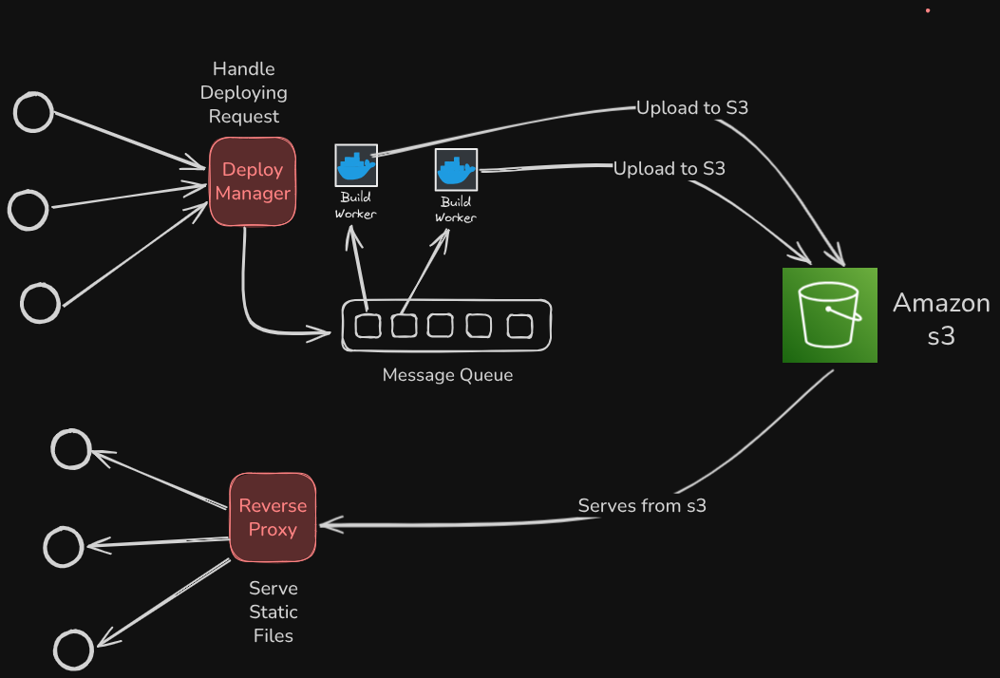

# 🚀 DeployIt – React-Powered Vercel Clone

⚡ **DeployIt** – A lightweight one-click cloud deployment platform for React apps.  
Connect your repo, deploy instantly, and skip the DevOps hassle.

---

## 🧱 System Architecture

> _A simple request → deploy flow: React handles the UI, Express handles logic, and MongoDB stores metadata._

---

## 🧰 Tech Stack

| Part          | Tech                     |
|---------------|--------------------------|
| Frontend      | React.js, Tailwind CSS   |
| Backend       | Node.js, Express.js      |
| Database      | MongoDB                  |
| Hosting       | Vercel (frontend), AWS (Backend) |
| File Storage  | AWS S3 |
| Auth (WIP)    | Google OAuth (future)    |

---

## 🔥 Features

- 🧠 **Simple UI** – Upload and deploy in seconds
- 🗂️ **Dashboard** – View and manage your deployed projects
- 🌍 **Preview Links** – Each project gets a unique link
- 📁 **Static Site Hosting** – Supports plain HTML/CSS/JS or React builds
- 🔐 **Coming Soon:** GitHub auth, deploy from repo

---
